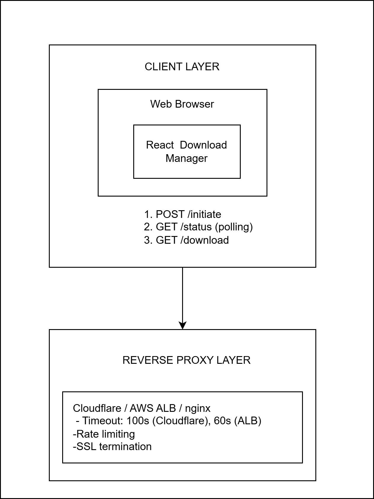
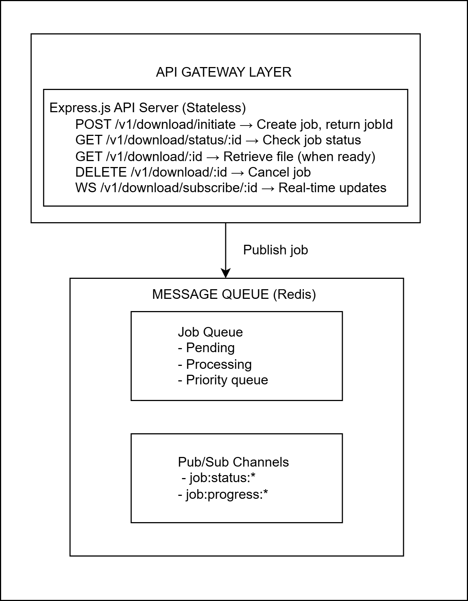

# ARCHITECTURE — Long-Running Downloads

This document describes a **complete implementation plan** for integrating the Delineate download microservice with a fullstack application while handling variable download times (fast: ~10s, slow: up to 120s+) gracefully.

---

## Table of Contents

1. [Architecture Diagram](#1-architecture-diagram)
2. [Technical Approach](#2-technical-approach-chosen-polling-pattern)
3. [Implementation Details](#3-implementation-details)
4. [Proxy Configuration](#4-proxy-configuration)
5. [Frontend Integration](#5-frontend-integration)
6. [Notes & Alternatives](#6-notes--alternatives)
7. [References](#7-references)

---

## 1. Architecture Diagram

### High-Level System Architecture

The following diagrams illustrate the proposed system architecture and data flows:

#### System Architecture Components





#### System Overview


#### Full Architecture Document
📄 [Complete Architecture PDF](Diagram/full%20architecture.drawio.pdf)
## 2. Technical Approach (Chosen: Polling Pattern)

We choose **Option A: Polling** because it is simple, robust across proxies and browsers, and avoids long-held HTTP connections. It works well even behind strict gateways (Cloudflare/nginx/ALB) and is easy to scale horizontally.

Flow:

```
Client → POST /v1/download/initiate → Returns { jobId } immediately
Client → GET  /v1/download/status/:jobId (poll every N seconds)
Client → GET  /v1/download/:jobId (when ready) → 302 to presigned S3 URL
```

Benefits:
- Eliminates gateway timeouts by returning quickly.
- Supports stateless retries and simple deduplication via `clientRequestId`.
- Plays nicely with CDNs and reverse proxies.

## 3. Implementation Details

### 3.1 API Contracts

- `POST /v1/download/initiate`
  - Request: `{ file_id: number, clientRequestId?: string, userId?: string, priority?: 'low'|'normal'|'high' }`
  - Response: `{ jobId: string, nextPollInMs: number, expiresAt: string }`
  - Behavior: enqueue job and return immediately; idempotency on `clientRequestId`.

- `GET /v1/download/status/:jobId`
  - Response:
    ```json
    {
      "jobId": "...",
      "status": "queued|running|processing_artifacts|completed|failed|expired",
      "progress": { "percent": 0 },
      "attempts": 1,
      "timestamps": { "queuedAt": "...", "startedAt": "...", "updatedAt": "..." },
      "result": { "url": "https://...", "expiresAt": "..." }
    }
    ```
  - HTTP 404 for unknown job; HTTP 409 when not yet complete if `GET /v1/download/:jobId` is used prematurely.

- `GET /v1/download/:jobId`
  - Behavior: If completed, 302 redirect to presigned S3 URL; otherwise 409 with latest status.

### 3.2 New/Internal Endpoints (optional)

- `POST /v1/download/cancel/:jobId` (optional) — cancel a running job.
- `GET  /v1/download/history?userId=...` (optional) — paginate a user’s recent jobs.

### 3.3 Storage & Schema

Use a cache (Redis or in-memory for demo) to track jobs:

- Key: `download:job:{jobId}` → JSON
- Fields:
  ```json
  {
    "jobId": "...",
    "fileId": 70000,
    "status": "queued|running|processing_artifacts|completed|failed|expired",
    "progress": { "percent": 0 },
    "attempts": 0,
    "timestamps": { "queuedAt": "...", "startedAt": null, "updatedAt": "..." },
    "result": { "url": null, "expiresAt": null },
    "clientRequestId": "optional",
    "userId": "optional",
    "priority": "normal"
  }
  ```
- TTL: configurable `DOWNLOAD_JOB_TTL_MS` to auto-expire old jobs.

S3:
- Bucket: `downloads`
- Use presigned URLs for direct downloads (short TTLs, e.g., 10–30 minutes).

### 3.4 Background Job Processing

- Queue: BullMQ-like abstraction or simple in-memory queue for demo.
- Worker: `DOWNLOAD_WORKER_CONCURRENCY` controls parallelism.
- States: `queued → running → processing_artifacts → completed|failed`.
- Delays: `DOWNLOAD_DELAY_MIN_MS`, `DOWNLOAD_DELAY_MAX_MS` simulate variability.

### 3.5 Error Handling & Retries

- Retries: exponential backoff up to `N` attempts for transient errors (e.g., S3 hiccups).
- Idempotency: deduplicate on `clientRequestId`.
- Failures: mark status `failed`, include `errorCode`, `errorMessage`, and `lastAttemptAt`.
- Sentry: capture backend errors with `trace_id` attached.

### 3.6 Timeout Configuration

- Client request timeout: keep low (e.g., 30s) since `initiate` is fast.
- Proxy timeouts: retain defaults; never hold long connections.
- Job TTL: set per requirements; expired jobs → `expired` and removed from cache.

## 4. Proxy Configuration

### 4.1 Cloudflare

- Keep requests short (initiate + polling).
- Prefer polling over long-held HTTP connections.
- Enable WebSocket/SSE only if using a hybrid approach.

### 4.2 nginx Configuration

Example configuration for handling the polling pattern:

```nginx
server {
  listen 80;
  server_name your.domain;

  location / {
    proxy_pass http://api:3000;
    proxy_http_version 1.1;
    proxy_set_header Upgrade $http_upgrade;
    proxy_set_header Connection "upgrade";
    
    # Short timeouts for fast requests
    proxy_read_timeout 60s;
    proxy_send_timeout 60s;
    proxy_connect_timeout 10s;
    
    # Buffering settings
    proxy_buffering on;
    proxy_buffer_size 4k;
    proxy_buffers 8 4k;
    
    # Headers
    proxy_set_header Host $host;
    proxy_set_header X-Real-IP $remote_addr;
    proxy_set_header X-Forwarded-For $proxy_add_x_forwarded_for;
    proxy_set_header X-Forwarded-Proto $scheme;
  }
}
```

**Key Settings**:
- `proxy_read_timeout`: 60s (sufficient for polling pattern)
- `proxy_buffering`: Enabled for better performance
- Keep timeouts short since we're not holding long connections

### 4.3 AWS ALB Configuration

**Settings**:
- **Idle Timeout**: Default 60s is fine for polling
- **Connection Draining**: Enable with 30s timeout
- **Health Checks**: Configure to `/health` endpoint
- **Target Group**: Use HTTP with path pattern routing

**Example ALB Configuration**:
```yaml
TargetGroupAttributes:
  - Key: deregistration_delay.timeout_seconds
    Value: '30'
  - Key: stickiness.enabled
    Value: 'true'
  - Key: stickiness.type
    Value: 'lb_cookie'
    
HealthCheckConfiguration:
  Path: /health
  Interval: 30
  Timeout: 5
  HealthyThreshold: 2
  UnhealthyThreshold: 3
```

---

## 5. Frontend Integration (React/Vite)

### 5.1 Implementation Flow

```typescript
// 1. Initiate Download
const initiateDownload = async (fileId: number) => {
  const response = await fetch('/v1/download/initiate', {
    method: 'POST',
    headers: { 'Content-Type': 'application/json' },
    body: JSON.stringify({ file_id: fileId })
  });
  const { jobId, nextPollInMs } = await response.json();
  
  // Save to localStorage for persistence
  localStorage.setItem(`job_${jobId}`, JSON.stringify({ 
    jobId, 
    fileId, 
    status: 'queued',
    createdAt: new Date().toISOString()
  }));
  
  return { jobId, nextPollInMs };
};

// 2. Poll for Status
const pollJobStatus = async (jobId: string) => {
  const response = await fetch(`/v1/download/status/${jobId}`);
  const status = await response.json();
  
  // Update localStorage
  const existing = JSON.parse(localStorage.getItem(`job_${jobId}`) || '{}');
  localStorage.setItem(`job_${jobId}`, JSON.stringify({
    ...existing,
    ...status,
    lastPolled: new Date().toISOString()
  }));
  
  return status;
};

// 3. Download Complete File
const downloadFile = async (jobId: string) => {
  // This will redirect to the presigned S3 URL
  window.location.href = `/v1/download/${jobId}`;
};
```

### 5.2 UI Components

**Progress Component**:
```typescript
const DownloadProgress = ({ jobId }: { jobId: string }) => {
  const [status, setStatus] = useState(null);
  
  useEffect(() => {
    const interval = setInterval(async () => {
      const data = await pollJobStatus(jobId);
      setStatus(data);
      
      if (data.status === 'completed' || data.status === 'failed') {
        clearInterval(interval);
      }
    }, 5000); // Poll every 5 seconds
    
    return () => clearInterval(interval);
  }, [jobId]);
  
  return (
    <div>
      <h3>Download Status: {status?.status}</h3>
      <ProgressBar value={status?.progress?.percent || 0} />
      {status?.status === 'completed' && (
        <button onClick={() => downloadFile(jobId)}>
          Download File
        </button>
      )}
    </div>
  );
};
```

### 5.3 Error Handling

- **Network Errors**: Show retry button, log to Sentry
- **Job Expired**: Clear from localStorage, show message to re-initiate
- **Failed Status**: Display error message, allow re-download
- **Timeout**: After N failed polls, mark as potentially stuck

### 5.4 Concurrency Management

Track multiple jobs:
```typescript
const useDownloads = () => {
  const [jobs, setJobs] = useState<Job[]>([]);
  
  useEffect(() => {
    // Load all jobs from localStorage on mount
    const allJobs = Object.keys(localStorage)
      .filter(key => key.startsWith('job_'))
      .map(key => JSON.parse(localStorage.getItem(key) || '{}'));
    
    setJobs(allJobs);
  }, []);
  
  return { jobs, addJob, removeJob };
};
```

### 5.5 Observability Integration

**Sentry Error Boundary**:
```typescript
import * as Sentry from '@sentry/react';

<Sentry.ErrorBoundary fallback={<ErrorFallback />}>
  <App />
</Sentry.ErrorBoundary>
```

**OpenTelemetry Spans**:
```typescript
import { trace } from '@opentelemetry/api';

const tracer = trace.getTracer('download-frontend');

const downloadWithTracing = async (fileId: number) => {
  return tracer.startActiveSpan('download-initiate', async (span) => {
    try {
      const result = await initiateDownload(fileId);
      span.setStatus({ code: SpanStatusCode.OK });
      span.setAttribute('job.id', result.jobId);
      return result;
    } catch (error) {
      span.setStatus({ code: SpanStatusCode.ERROR });
      span.recordException(error);
      throw error;
    } finally {
      span.end();
    }
  });
};
```

**Trace Propagation**:
```typescript
// Inject traceparent header in all API calls
const fetchWithTracing = async (url: string, options: RequestInit) => {
  const span = trace.getActiveSpan();
  const headers = {
    ...options.headers,
    'traceparent': span?.spanContext() ? 
      `00-${span.spanContext().traceId}-${span.spanContext().spanId}-01` : 
      undefined
  };
  
  return fetch(url, { ...options, headers });
};
```

---

## 6. Notes & Alternatives

- **Hybrid** (Polling + SSE): Use polling for reliability; optional SSE/WebSocket for realtime progress when infrastructure supports it.
- **Webhooks**: For server-to-server integrations, accept `callbackUrl` on initiate and POST results when done.

## 7. References

- W3C Trace Context
- OpenTelemetry JavaScript
- Sentry React SDK
- Redis/BullMQ
- Presigned S3 URLs
